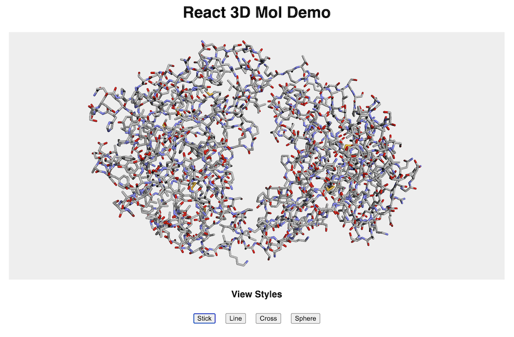

# 3D Mol Renderer Sample App

## Building & Running
Simply run
`yarn install` or `npm install`
then
`yarn start` or `npm start`

Open [http://localhost:3000](http://localhost:3000) to view it in the browser.

## Info
`MolRenderer.jsx` contains the main viewer integration with 3DMolJS.
Using the 3DMol library, we create a viewer object that imports model data and associated styling.
That viewer object is then embedded in a div with configurable height and width.

Various styles are set from the parent react component and passed into the renderer as props.

Data is read from a sample JS file and supports PDB & SDF filetypes. The raw text is copied into the JS for testing purposes, future work can support directly loading from a SDF file.